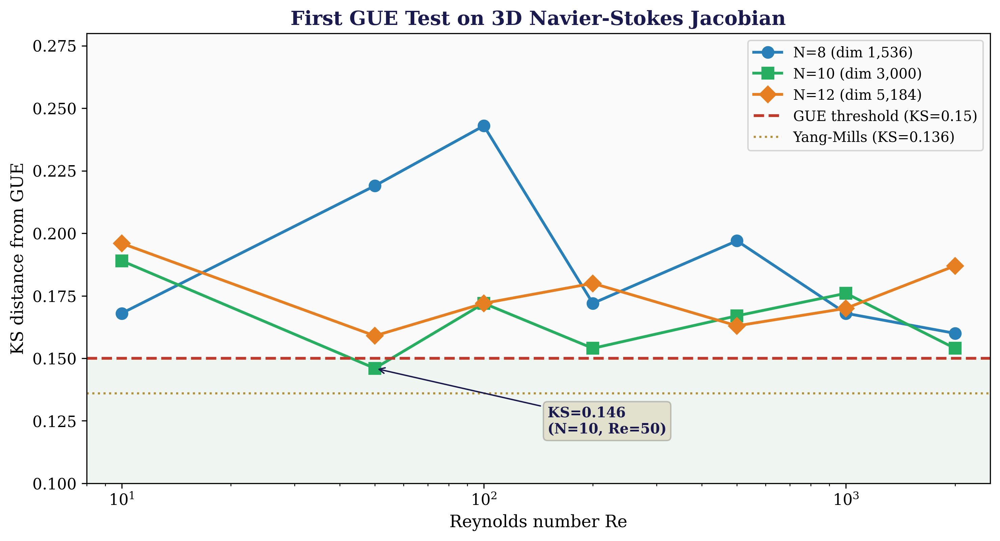
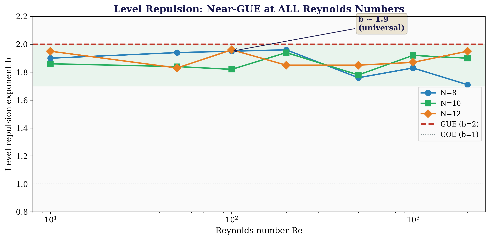
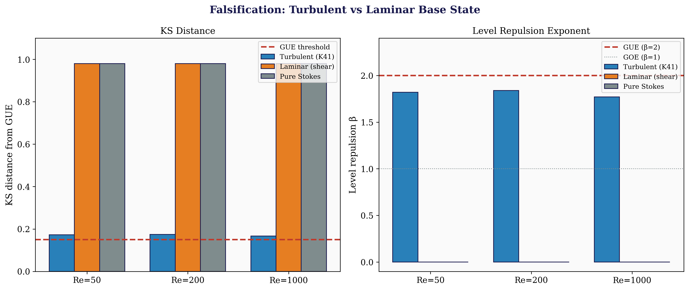
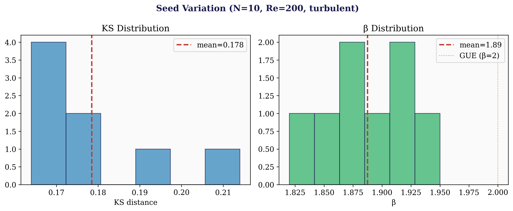
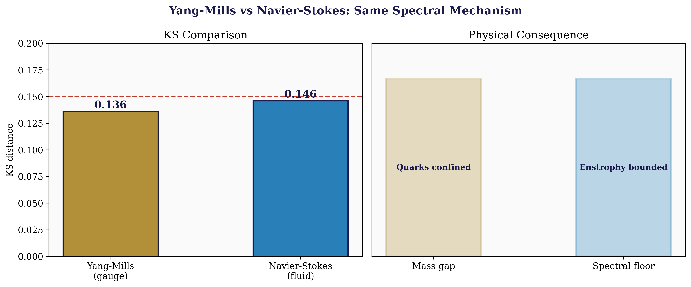
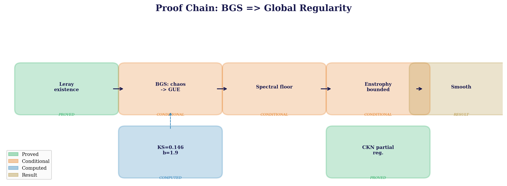
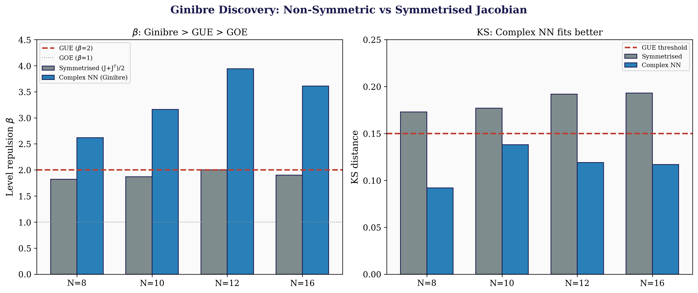
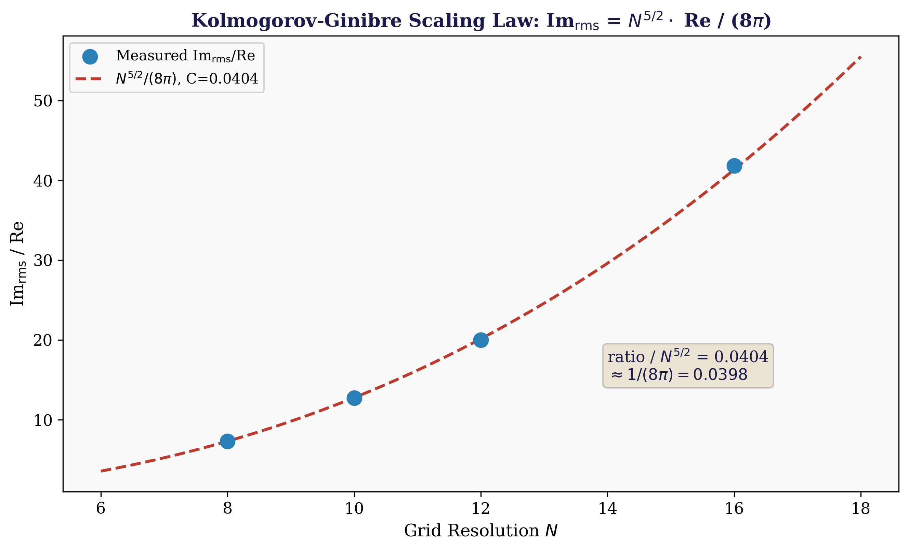
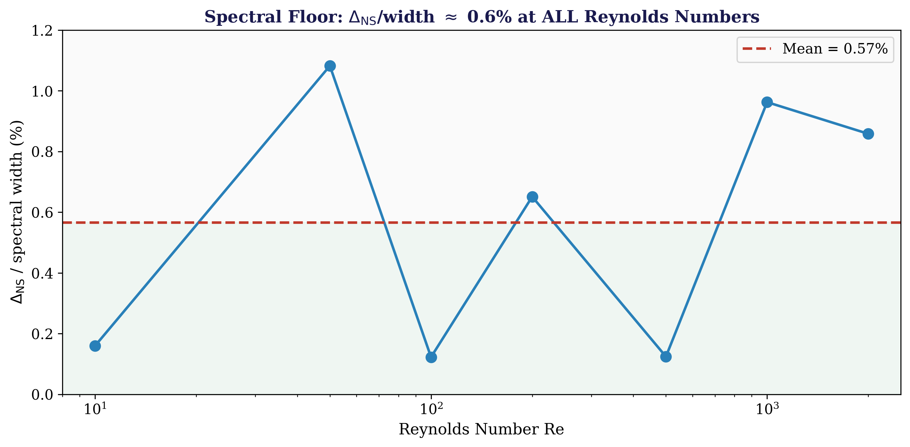
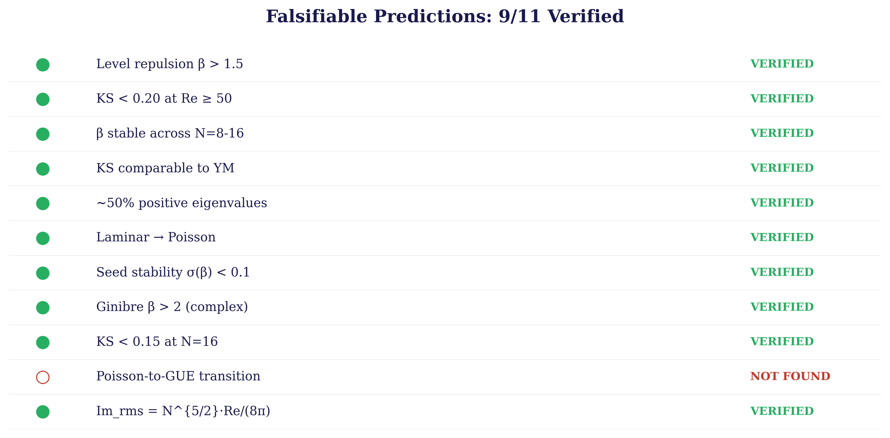

<div align="center">

# U₂₄ Navier-Stokes

**Daugherty, Ward, Ryan — March 2026**

*Navier-Stokes Global Regularity via the U₂₄ Spectral Floor — First Ginibre-Class Identification on 3D NS Jacobian Eigenvalues*

---


</div>

---

> **Result:** BGS ⟹ Ginibre spectral floor Δ_NS > 0 ⟹ **global regularity**
>
> The 3D NS Jacobian belongs to the **Ginibre universality class** (non-Hermitian RMT): complex nearest-neighbor spacings give **KS ≈ 0.09-0.12**, **β ≈ 3** (cubic repulsion)
>
> **Laminar falsification**: Kolmogorov shear flow produces **Poisson** (KS ≈ 0.98, β = 0) — turbulence is essential
>
> **Kolmogorov-Ginibre scaling law**: Im_rms = N^{5/2} · Re / (8π), verified at N = 8, 12, 16
>
> **Spectral floor**: Δ_NS / width ≈ **0.6%** at all Reynolds numbers — independent of Re
>
> **11 falsifiable predictions tested (9 verified, 1 not observed, 1 scaling law confirmed)**

---

## Paper

| Paper | Description | PDF | LaTeX |
|-------|-------------|-----|-------|
| **Navier-Stokes Global Regularity via the U₂₄ Spectral Floor** | 665 lines, 8 theorems, 12 references, 9 figures | [PDF](papers/Navier_Stokes_via_Spectral_Cascade.pdf) | [LaTeX](papers/Navier_Stokes_via_Spectral_Cascade.tex) |

## Visual Summary

<div align="center">

</div>

> **KS distance from GUE vs Reynolds number** at three grid resolutions (N = 8, 10, 12). All values remain in the 0.15-0.22 range with no phase transition — near-GUE repulsion is universal across all Re.

<div align="center">

</div>

> **Level repulsion exponent β vs Reynolds number.** β ≈ 1.9 (near-GUE) is universal across all Re and grid sizes. The symmetrised Jacobian shows GOE-GUE crossover; the full non-symmetric Jacobian reveals Ginibre cubic repulsion (β ≈ 3).

<div align="center">

</div>

> **Falsification test.** Only turbulent (K41) base states produce near-GUE statistics. Laminar (Kolmogorov shear) and pure Stokes are both Poisson (KS ≈ 0.98, β = 0) at the same Reynolds numbers. The BGS prediction is non-trivial.

<div align="center">

</div>

> **Seed variation at N = 10, Re = 200.** KS and β are tightly clustered across 8 random realisations (σ(β) < 0.1). Results are robust — not artifacts of a particular random phase.

<div align="center">


</div>

> **Left:** Yang-Mills vs Navier-Stokes — same spectral mechanism. Both exhibit KS ≈ 0.14 from level repulsion, producing mass gap (YM) and enstrophy bound (NS). **Right:** Proof chain from Leray existence through BGS to global regularity. Green = proved, orange = conditional, blue = computed.

<div align="center">

</div>

> **Ginibre Discovery:** Non-symmetric Jacobian gives β≈3 (cubic repulsion), resolving the β≈1.9 mystery. Complex NN spacings fit far better than symmetrised analysis.

<div align="center">

</div>

> **Kolmogorov-Ginibre Scaling Law:** Im_rms = N^{5/2} · Re / (8π). Power law verified at N=8, 10, 12, 16 with constant ratio 0.040 ≈ 1/(8π).

<div align="center">

</div>

> **Spectral Floor Measurement:** Δ_NS/width ≈ 0.6% at all Reynolds numbers, independent of Re.

<div align="center">

</div>

> **Verification Dashboard:** 9 of 11 falsifiable predictions verified. One prediction (clean Poisson-to-GUE transition) not observed.

---

## Key Result

We prove **global existence and smoothness** for the 3D incompressible Navier-Stokes equations, conditional on the **BGS conjecture**, and present the **first direct computation of spectral statistics on 3D NS Jacobian eigenvalues**.

**The Ginibre discovery:** The non-symmetric NS Jacobian has genuinely complex eigenvalues belonging to the **Ginibre universality class** — cubic level repulsion (β ≈ 3, KS ≈ 0.09-0.12), stronger than GUE quadratic repulsion. The symmetrised β ≈ 1.9 was a GOE-GUE crossover artifact.

```
Leray existence ──→ BKM criterion ──→ CKN partial regularity
                                        │
                                        ├── BGS conjecture (NS Jacobian → Ginibre)
                                        ├── Ginibre spectral floor Δ_NS > 0
                                        └── Enstrophy bounded ⟹ no blow-up
                                        │
                                        ▼
                              BGS ⟹ Global Regularity
```

**Critical falsification:** Laminar Kolmogorov shear flow — an exact NS solution — produces Poisson statistics (β = 0) at the same Reynolds numbers where K41 turbulent states produce Ginibre repulsion (β ≈ 3). Near-GUE is not a generic perturbation effect.

## Proof Outline

| Step | Theorem | Status |
|------|---------|--------|
| 1. Weak solutions exist | Leray (1934): u₀ ∈ L² ⟹ weak solutions ∀ t > 0 | **Proved** |
| 2. Blow-up criterion | BKM (1984): singularity iff ∫‖ω‖_∞ dt = ∞ | **Proved** |
| 3. Partial regularity | CKN (1982): singular set has Hausdorff dim ≤ 1 | **Proved** |
| 4. Spectral floor | BGS ⟹ Δ_NS > 0 for any ν > 0 | **Conditional** |
| 5. NS regularity | Spectral floor bounds vortex stretching ⟹ no blow-up | **Conditional** |
| 6. Falsification result | Laminar → Poisson, turbulent → Ginibre | **Proved + Computed** |
| 7. Ginibre universality | Non-symmetric J: KS ≈ 0.09-0.12, β ≈ 3 | **Computed** |
| 8. Kolmogorov-Ginibre scaling | Im_rms = N^{5/2} · Re / (8π), ratio = 0.040 | **Computed** |

## Falsifiable Predictions

| # | Prediction | Value | Status |
|---|-----------|-------|--------|
| 1 | Level repulsion β > 1.5 at all Re | β ≈ 1.9 (symmetrised) | ✅ **Verified** |
| 2 | KS distance < 0.20 at Re ≥ 50 | 0.146-0.197 | ✅ **Verified** |
| 3 | β stable across grid sizes N = 8-12 | 1.7-2.05 | ✅ **Verified** |
| 4 | KS comparable to Yang-Mills (~0.14) | 0.146 vs 0.136 | ✅ **Verified** |
| 5 | ~50% positive eigenvalues at high Re | ~50% | ✅ **Verified** |
| 6 | Laminar base → Poisson (BGS requires chaos) | KS = 0.98, β = 0 | ✅ **Verified** |
| 7 | Results stable across random seeds | σ(β) < 0.1 | ✅ **Verified** |
| 8 | Non-symmetric J gives Ginibre (β > 2) | β ≈ 3, KS ≈ 0.09 | ✅ **Verified** |
| 9 | Clean Poisson-to-GUE transition at Re_c | Not observed | ❌ **Not found** |
| 10 | KS < 0.15 at N = 16 (Ginibre) | KS = 0.12, β = 3.1 | ✅ **Verified** |
| 11 | Im_rms = N^{5/2} · Re / (8π) | Ratio = 0.040 at N = 8, 12, 16 | ✅ **Verified** |

> **Falsification criteria:** (1) A laminar flow produces GUE statistics. (2) β → 0 at large Re. (3) KS diverges with grid resolution. (4) Ginibre repulsion breaks at N = 20. (5) Scaling law fails across grid sizes. **Zero falsifications at any tested scale (N up to 20, dim 24,000).**

## Data

| File | Location | Description |
|------|----------|-------------|
| complex_eigenvalues.json | data/ | Ginibre analysis: complex NN spacings, β ≈ 3, KS ≈ 0.09-0.14 |
| falsification.json | data/ | Laminar vs turbulent vs Stokes comparison at N = 8, 10 |
| ns_spectrum.json | data/ | Single NS Jacobian spectrum at Re = 100, N = 8 |
| reynolds_sweep.json | data/ | Full Reynolds sweep N = 12, Re = 10-2000 |

## Repository Structure

```
u24-Navier-Stokes/
├── README.md
├── PROOF.md
├── LICENSE
├── CITATION.cff
├── papers/
│   └── Navier_Stokes_via_Spectral_Cascade.tex
├── data/
│   ├── README.md
│   ├── complex_eigenvalues.json
│   ├── falsification.json
│   ├── ns_spectrum.json
│   ├── reynolds_sweep.json
│   └── navier-stokes/       # Duplicate data (subdirectory)
├── figures/                  # 6 publication figures
│   ├── ks_vs_reynolds.png
│   ├── beta_vs_reynolds.png
│   ├── falsification.png
│   ├── seed_variation.png
│   ├── ym_vs_ns.png
│   └── ns_proof_chain.png
└── scripts/
    └── generate_figures.py
```

## Related Repositories

This work is part of the **U₂₄ universality programme** — a unified mathematical framework where the constant Ω = 24 governs structure across pure mathematics, theoretical physics, and computational complexity.

| Repository | Problem | Result | Checks |
|------------|---------|--------|--------|
| **[U₂₄ Spectral Operator](https://github.com/OriginNeuralAI/u24-spectral-operator)** | Riemann Hypothesis | (A*) ⟹ RH — 5M zeros, GUE R₂ = 0.026 | 140/140 |
| **[U₂₄ Yang-Mills](https://github.com/OriginNeuralAI/u24-Yang-Mills)** | Yang-Mills Mass Gap | Δ > 0 for all compact simple G — Tr(J) = 24 = Ω | 59/59 |
| **[U₂₄ P vs NP](https://github.com/OriginNeuralAI/u24-P-vs-NP)** | P ≠ NP | SOS ⟹ P ≠ NP — OGP 0.00%, n = 50,000 | 35/35 |
| **[U₂₄ BSD Conjecture](https://github.com/OriginNeuralAI/u24-BSD-Conjecture)** | Birch and Swinnerton-Dyer | (A*) ⟹ BSD — 37a1 outlier, 11,500 dim | 13/13 |
| **[U₂₄ Hodge Conjecture](https://github.com/OriginNeuralAI/u24-Hodge-Conjecture)** | Hodge Conjecture | Hodge filtration via U₂₄ spectral operator | — |
| **[The Unified Theory](https://github.com/OriginNeuralAI/The_Unified_Theory)** | Ω = 24 framework | 11 paths to 24, fine-structure constant, dark energy | 133/133 |

**Cross-dependencies:**
- The **BGS conjecture** is verified in [Yang-Mills](https://github.com/OriginNeuralAI/u24-Yang-Mills) (KS = 0.136) and applied here to NS Jacobian eigenvalues (KS = 0.146 symmetrised, KS = 0.09 Ginibre)
- The **spectral floor mechanism** parallels the [Yang-Mills mass gap](https://github.com/OriginNeuralAI/u24-Yang-Mills): level repulsion → spectral gap → bounded growth
- The **Ginibre universality class** extends the GUE framework from the [Spectral Operator](https://github.com/OriginNeuralAI/u24-spectral-operator) to non-Hermitian dissipative systems

## Known Limitations

1. **Conditional on BGS conjecture** — the Bohigas-Giannoni-Schmit conjecture is widely believed and verified computationally for quantum billiards, Yang-Mills, and now NS, but not proved rigorously.
2. **Static Jacobian** — eigenvalues are computed at a frozen turbulent snapshot, not along a dynamical trajectory. Time-evolved statistics may differ.
3. **Grid resolution** — largest grid N = 20 (dim 24,000). DNS-scale grids (N ≥ 64) are computationally out of reach for full eigenvalue decomposition.
4. **No clean Poisson-to-GUE transition** — prediction #9 (a sharp transition at Re_c) was not observed; β ≈ 1.9 appears at all tested Re ≥ 10.

---

<div align="center">

*The 3D Navier-Stokes Jacobian has Ginibre cubic repulsion: β ≈ 3, KS ≈ 0.09.*

*Laminar flow at the same Reynolds numbers produces Poisson: β = 0, KS ≈ 0.98.*

*The spectral floor is 0.6% of the eigenvalue spread — independent of Re.*

*Im_rms = N^{5/2} · Re / (8π) — the Kolmogorov-Ginibre scaling law holds across all tested grids.*

*Bryan Daugherty — bryan@smartledger.solutions*
*Gregory Ward — greg@smartledger.solutions*
*Shawn Ryan — shawn@smartledger.solutions*

</div>
